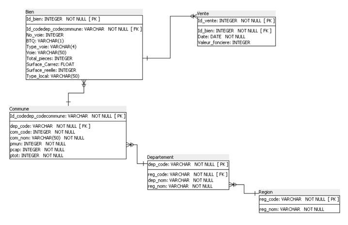
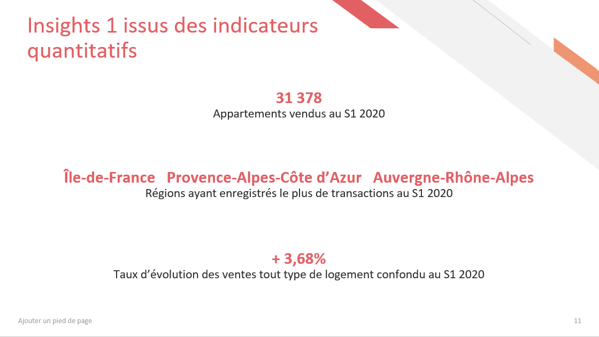
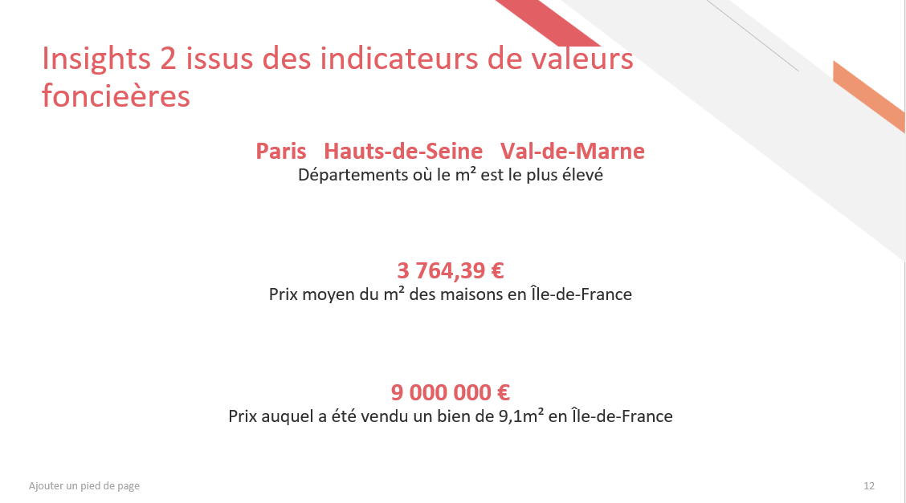
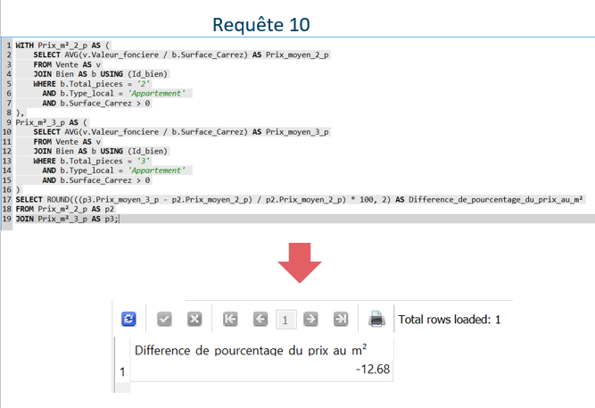

# Projet 5 – Créez et utilisez une base de données immobilière avec SQL

## Contexte du projet

Ce projet consiste en un **diagnostic de l'état du marché immobilier** à partir des données du 1er semestre 2020.  
L’objectif est de créer et d’utiliser une **base de données SQL** afin de générer des indicateurs fiables sur le marché immobilier. Selon les résultats obtenus, les données seront étendues aux autres semestres/années.

Le projet implique :
- la collecte de données volumineuses issues de plusieurs sources (valeurs foncières, référentiel géographique, données communes),
- l’anonymisation et la suppression des données personnelles,
- le respect de la **loi RGPD** et la mise en place d’une **stratégie de sauvegarde**.

---

## Objectifs pédagogiques

- Créer une base de données en respect des **normes réglementaires** et des besoins clients  
- Effectuer des **requêtes SQL** pour répondre à une problématique métier tout en respectant le **RGPD**  
- Gérer une base de données, effectuer des requêtes et garantir la **cohérence et la fiabilité des données**

---

## Outils utilisés

- **SQL** pour la création et l’exploitation des bases de données

---

## Résultats du projet

Le projet a suivi plusieurs étapes :

1. **Préparation des données**
   - Sélection des colonnes utiles
   - Suppression des données personnelles et inutiles
   - Création d’un **dictionnaire des données** pour comprendre la structure et les types

2. **Modélisation de la base**
   - Création d’un **schéma relationnel normalisé**
   - Définition des **clés primaires et étrangères**
   - Assurer l’absence de redondance dans les tables

3. **Chargement et vérification des données**
   - Création des tables
   - Chargement de 34 169 lignes pour la table principale
   - Vérification des statuts des requêtes pour confirmer l’intégrité des données

4. **Requêtes SQL et insights**
   - Requêtes sur les volumes de transactions et les valeurs foncières
   - **Insight 1 :** 31 378 appartements vendus au semestre 1 2020, régions les plus actives : Île-de-France, Provence-Alpes-Côte d’Azur et Auvergne-Rhône-Alpes. Progression globale de +3,68% des ventes.  
   - **Insight 2 :** Les départements les plus chers par m² : Paris, Hauts-de-Seine, Val-de-Marne. Prix moyen du m² à Paris : 3 764,39 €. Exemple extrême : un bien de 9,1m² vendu à 9 millions d’euros.

Les résultats permettent :
- de mieux connaître l’état du marché immobilier par zone géographique
- de comparer les volumes et valeurs
- d’identifier les tendances pour ajuster les stratégies commerciales des agences

---

## Compétences acquises

- Création et gestion d’une **base de données SQL**
- Préparation et transformation des données
- Analyse des **volumes et valeurs immobilières**
- Conformité **RGPD** et anonymisation des données
- Création d’un **schéma relationnel normalisé**
- Capacité à extraire des **insights métier** à partir de requêtes SQL

---

## Illustrations

### Schéma relationnel

### Insight – Volume des transactions

### Insight – Valeur foncière par département

### Exemple de requête SQL

